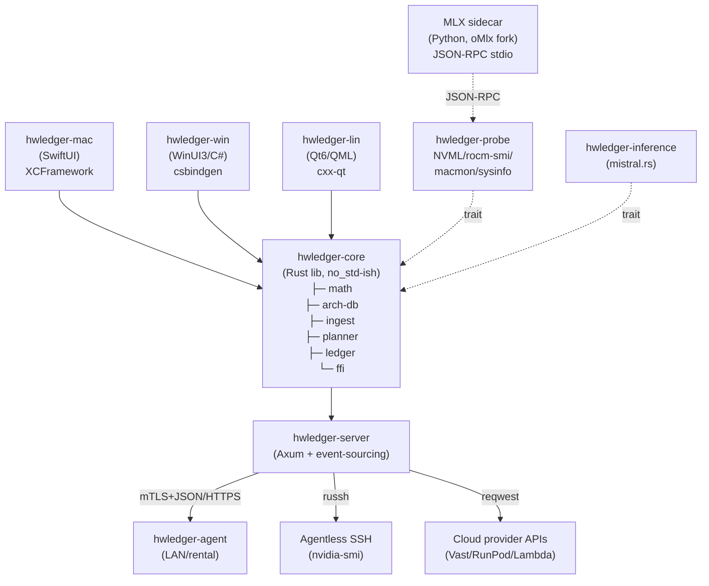

# Architecture

## Component Map

The system is organized into a shared Rust core consumed by three native GUI frontends, with supporting infrastructure for inference, telemetry, and fleet management.

## Live Traceability

Every feature is traceable from spec through test to code:

<RecordingEmbed tape="traceability-report" kind="cli" caption="CLI traceability: spec -> test -> code report (CLI-only — report text is the feature)" />

See [Traceability Report](/quality/traceability) for methodology and verification gates.

## Architecture Decisions

See [Architecture Decision Records](/architecture/adrs) for detailed rationale on:

- **ADR-0001**: Rust core with three native GUIs (SwiftUI, WinUI 3, Qt 6)
- **ADR-0002**: oMlx fat fork for SSD-paged KV cache on macOS
- **ADR-0003**: Axum + mTLS for fleet wire (not gRPC)
- **ADR-0004**: Math core dispatch per AttentionKind
- **ADR-0005**: Shared crate reuse across Phenotype org
- **ADR-0007**: Raw C FFI over UniFFI (WinUI/Qt fallback)

## System Layers

### Math Core (§5.1)

Architecture-keyed KV cache and parameter formulas:

- **Dispatch**: MHA / GQA / MQA / MLA / Sliding / SSM / Hybrid / Sink
- **Resident vs Active**: Separate treatment for MoE parameters
- **Live breakdown**: Per-layer VRAM and throughput estimates
- **Reconciliation**: Compare predictions vs telemetry

### Config Ingestion (§5.2)

Multi-backend model config loading:

- **HF Hub**: Pure Rust via `hf-hub` crate
- **GGUF**: Pure Rust via `gguf-rs-lib` crate
- **safetensors**: Pure Rust via `safetensors` crate
- **MLX .npz**: Subprocess-based inspection with Python
- **Ollama/LM Studio/vLLM**: REST API endpoints

### GPU Telemetry (§5.3)

Extensible probe with per-vendor backends:

- **NVIDIA**: `nvml-wrapper` (canonical, production-grade)
- **AMD**: Shell out to `rocm-smi --json`
- **Apple Silicon**: Shell out to `macmon --json`
- **Intel Arc**: Vacuum (deferred)

### Fleet Wire (§5.4)

Event-sourced ledger with three dispatch modes:

- **Agent-based**: Axum + rustls mTLS for orchestrated nodes
- **Agentless SSH**: `russh` + `deadpool` for one-off hosts
- **Cloud provider**: `reqwest` + vendor SDKs (Vast.ai, RunPod, Lambda, Modal)

All modes feed into a shared SQLite audit log with `phenotype-event-sourcing` backend.

## Key Trade-offs

| Aspect | Choice | Why |
|--------|--------|-----|
| **FFI** | UniFFI for SwiftUI, raw C for WinUI/Qt | UniFFI auto-generates Swift bindings; C# has native interop; Qt has cxx-qt |
| **Sidecar** | HTTP + JSON-RPC over subprocess | Avoids PyObjC/venv build complexity; proven pattern in mistral.rs/Ollama |
| **Fleet wire** | Axum + mTLS | Simpler than gRPC for fleet-of-tens scale; mTLS via `rustls+rcgen` (no PKI) |
| **Event sourcing** | SQLite + phenotype-event-sourcing | Portable, no Postgres; reuse existing Phenotype module |
| **Inference engines** | MLX (macOS) + mistral.rs (portable) | MLX is Apple peak; mistral.rs is Rust-native and MoE-aware; llama.cpp fallback |

## Development Workflow

1. **Math core** (P1): Implement formula tree; unit test per architecture
2. **Config ingest** (P2): Load HF/GGUF configs; validate against real models
3. **Planner** (P2): UI over formula tree with live breakdown slider
4. **Probe** (P2): Telemetry backends for NVIDIA/AMD/Apple Silicon
5. **Inference** (P4): Subprocess + JSON-RPC sidecar on macOS, mistral.rs on others
6. **Fleet** (P5): Event log, agent orchestration, cost tracking

See PLAN.md in the repository root for detailed phased WBS.
