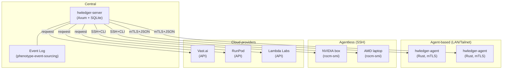

# Fleet Ledger Overview

The fleet ledger tracks heterogeneous hardware (local NVIDIA/AMD, Apple Silicon, cloud rentals) with a shared event-sourced audit log, cost model, and dispatch planner.

<ShotGallery
  title="Register — bootstrap a device"
  :shots='[
    {"src":"/cli-journeys/keyframes/fleet-register/frame-001.png","caption":"fleet register — bootstrap"},
    {"src":"/cli-journeys/keyframes/fleet-register/frame-003.png","caption":"Host added"}
  ]' />

<ShotGallery
  title="Audit — verify attestation chain"
  :shots='[
    {"src":"/cli-journeys/keyframes/fleet-audit/frame-002.png","caption":"audit — attestation hash"},
    {"src":"/cli-journeys/keyframes/fleet-audit/frame-005.png","caption":"audit summary"}
  ]' />

## Architecture



## Core Concepts

### Device Registration

Devices are registered with:

- **Hardware specs**: VRAM, CPU cores, network
- **Supported backends**: MLX, GGUF, Ollama, vLLM, TGI
- **Location**: LAN, tailnet, cloud provider
- **Transport**: Agent (mTLS), Agentless (SSH), API

<RecordingEmbed tape="fleet-gui-map" kind="gui" caption="GUI FleetMap: live-updating canvas view of every registered device (primary UI)" />

<RecordingEmbed tape="settings-gui-mtls" kind="gui" caption="Settings → mTLS: generate + pin client cert from the native desktop app" />

<RecordingEmbed tape="streamlit-fleet" kind="streamlit" caption="Streamlit Fleet: CRUD view over devices, labels, and transports in the browser" />

<RecordingEmbed tape="fleet-register" kind="cli" caption="CLI `fleet register`: bootstrap a new device (scripting / CI path)" />

<RecordingEmbed tape="fleet-audit" kind="cli" caption="CLI `fleet audit`: inspect the hash-chained audit log — CLI-native reason-of-record for audit-chain review" />

<ShotGallery
  title="Register — labels + first ledger event"
  :shots='[
    {"src":"/cli-journeys/keyframes/fleet-register/frame-002.png","caption":"Register step 2 — labels applied (tenant, env, gpu-class)"},
    {"src":"/cli-journeys/keyframes/fleet-register/frame-006.png","caption":"Register step 6 — first event written, ledger head advances"}
  ]' />

<ShotGallery
  title="Audit — per-agent verdicts and summary"
  :shots='[
    {"src":"/cli-journeys/keyframes/fleet-audit/frame-003.png","caption":"Audit: per-agent row with last-seen, backend, and hash verdict"},
    {"src":"/cli-journeys/keyframes/fleet-audit/frame-006.png","caption":"Audit summary: total events, chain length, verification duration"}
  ]' />

### Event Log

Every operation is logged as an immutable event:

```json
{
  "id": "evt-001",
  "timestamp": "2026-04-19T10:30:00Z",
  "device_id": "dev-nvidia-01",
  "event_type": "job_started",
  "payload": {
    "job_id": "job-123",
    "model": "llama-2-70b",
    "batch_size": 4,
    "estimated_duration_s": 300
  }
}
```

Events are immutable and append-only. No deletes or mutations.

### Cost Tracking

Per-device, per-job costs:

```
cost = (hardware_rate / 3600) × duration_s
```

For cloud providers:

```
cost = spot_price(provider, gpu_type) × duration_s + api_call_cost
```

Example:

```
NVIDIA RTX 4090 (local): $0/hr (owned)
Vast.ai RTX 4090: $0.28/hr
RunPod RTX 4090: $0.45/hr
AWS Lambda: $0.0001667/invocation + $0.0000166667/second
```

## Dispatch Planner

Given a model and batch size, find the optimal device:

1. **Collect device specs** from the fleet
2. **Calculate KV cache + weights** using math core
3. **Check VRAM fit** per device
4. **Estimate duration** using throughput models
5. **Score by cost** (cost-per-token or cost-per-second)
6. **Dispatch** to the winner, log the event

Example:

```
Query: llama-2-70b, batch_size=4, max_latency=30s

Candidate devices:
  - Local RTX 4090 (24 GB): fit✓ duration=45s cost=$0
  - Vast RTX 4090 (24 GB): fit✓ duration=48s cost=$0.004
  - RunPod RTX 4090 (24 GB): fit✓ duration=48s cost=$0.006
  - vLLM remote (8× GPU): fit✓ duration=8s cost=$0.01

Best: vLLM remote (lowest latency at <$0.01)
```

## Three Transport Modes

### 1. Agent-Based (Orchestrated)

**Setup**: hwledger-agent running on each device.

**Protocol**: Axum server + `rustls` mTLS.

**Features**:
- Auto-discovery (LAN mDNS, Tailnet API)
- Bidirectional communication
- Live resource monitoring
- Job queuing and prioritization

**Example**:

```bash
# On each device
hwledger-agent --server tcp://central.local:9000 --device-id my-rtx4090

# Central logs the device and can dispatch immediately
curl -X POST http://central:9000/dispatch \
  -d '{"job_id": "123", "device_id": "my-rtx4090", "model": "llama-70b"}'
```

### 2. Agentless (SSH)

**Setup**: SSH access to host; no agent required.

**Protocol**: `russh` + `deadpool` connection pool.

**Features**:
- One-off hosts
- Works on any SSH-enabled box
- Probes via `nvidia-smi`, `rocm-smi`, etc.
- No persistent connection

**Example**:

```bash
# Central probes the host
ssh user@gpu.example.com rocm-smi --json

# Parse response to get VRAM
# Dispatch via `ssh user@gpu.example.com ./run-inference.sh`
```

### 3. Cloud Provider APIs

**Setup**: API keys for Vast.ai, RunPod, Lambda, Modal.

**Protocol**: `reqwest` (async HTTP) + vendor SDKs.

**Features**:
- Spot pricing integration
- Automatic provisioning
- Billing aggregation
- Vendor-specific job tracking

**Example**:

```bash
# Query Vast.ai for available GPUs
curl https://api.vast.ai/api/v0/bundles?type=interruptible

# Provision an RTX 4090
curl -X POST https://api.vast.ai/api/v0/instances/create \
  -H "Authorization: Bearer $API_KEY" \
  -d '{"gpu_count": 1, "gpu_name": "RTX 4090"}'

# Poll status and dispatch once ready
```

## Example Workflow

```
User: "Run llama-2-70b on (batch_size=8, seq_length=4096)"

1. Math core calculates:
   - KV cache: 134 MB per layer × 80 = 10.7 GB
   - Weights: 70 GB
   - Total: ~80 GB (doesn't fit on 24 GB local RTX 4090)

2. Fleet planner queries devices:
   - Local RTX 4090: 24 GB (SKIP, too small)
   - Vast RTX A100 (80 GB): FIT at $0.40/hr
   - vLLM remote: FIT at $0.50/hr (faster)

3. Dispatch decision:
   - Option 1: Use local RTX 4090 with activation offloading (slower, free)
   - Option 2: Use Vast A100 (faster, $0.40/hr)
   - Option 3: Use vLLM remote (fastest, $0.50/hr)

4. User selects Option 2 (cost + speed tradeoff)

5. Server logs event:
   {
     "event_type": "job_dispatched",
     "job_id": "j-123",
     "device_id": "vast-a100-001",
     "model": "llama-2-70b",
     "config": {
       "batch_size": 8,
       "seq_length": 4096,
       "estimated_cost": 0.40,
       "estimated_duration_s": 120
     }
   }

6. Job runs; telemetry streamed back to central log

7. Event on completion:
   {
     "event_type": "job_completed",
     "job_id": "j-123",
     "actual_duration_s": 118,
     "actual_cost": 0.39,
     "tokens_generated": 4096,
     "throughput": 34.7
   }
```

## Cost Model

### Local Hardware (Depreciation)

```
monthly_cost = hardware_cost / lifespan_months
hourly_cost = monthly_cost / 730
```

Example: RTX 4090 at $1600, 5-year lifespan:

```
monthly = 1600 / 60 = $26.67
hourly = 26.67 / 730 = $0.0365/hr
```

### Cloud Rentals

Use vendor spot prices:

```
cost = spot_price(provider, gpu_type) × duration_s / 3600
```

Updated every 5 minutes from vendor APIs.

### Aggregation

Daily/monthly billing per device:

```json
{
  "period": "2026-04-19",
  "devices": [
    {
      "device_id": "local-rtx-4090",
      "model": "RTX 4090",
      "hours_used": 12.5,
      "cost": 0.46
    },
    {
      "device_id": "vast-a100-001",
      "model": "A100",
      "hours_used": 3.2,
      "cost": 1.28
    }
  ],
  "total_cost": 1.74,
  "total_throughput": 45000
}
```

## Future Enhancements

- **Queueing**: Job queue with SLA targets (e.g., <1 min latency)
- **Auto-scaling**: Automatically provision cloud instances based on queue depth
- **Spot price prediction**: Forecast price changes and optimize dispatch
- **Multi-GPU coordination**: Batch jobs across multiple GPUs with MPI/vLLM sharding
- **Offline sync**: Cache fleet state when central server is unreachable
- **Workload prediction**: Learn historical job patterns to pre-warm devices

See PLAN.md in the repository root §5 for Phase 5 fleet scope.
