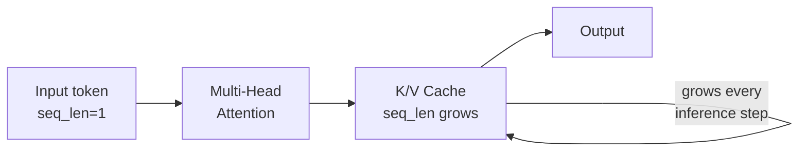
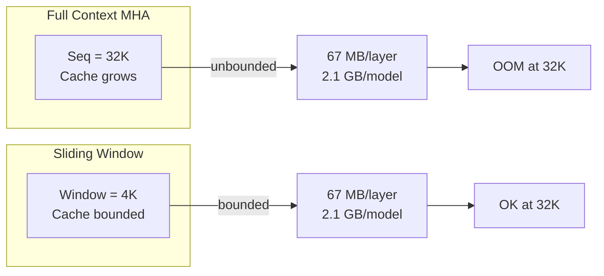

# KV Cache Formulas

<Shot src="/cli-journeys/keyframes/plan-deepseek/frame-003.png"
      caption="Live KV cache breakdown: weights / kv_cache / activations"
      size="medium" align="right"
      :annotations='[{"bbox":[120,340,220,28],"label":"kv_cache row","color":"#89b4fa"}]' />

<Shot src="/cli-journeys/keyframes/plan-mla-deepseek/frame-002.png"
      caption="Per-layer KV cache bytes"
      size="small" align="left"
      :annotations='[{"bbox":[140,200,260,32],"label":"per-layer bytes","color":"#a6e3a1"}]' />

The math core is the soul of hwLedger. This document walks through the derivation of KV cache formulas per attention architecture, with interactive breakdowns and live calculation.

## Overview

KV cache size depends on the **attention mechanism** (`AttentionKind`):

- **Multi-Head Attention (MHA)**: Full K and V for all heads
- **Grouped-Query Attention (GQA)**: Shared K and V across head groups
- **Multi-Query Attention (MQA)**: Single shared K and V
- **Multi-Head Latent Attention (MLA)**: Projected latent space
- **Sliding Window Attention**: Fixed-size context window
- **State Space Models (SSM/Mamba)**: Constant state per layer
- **Hybrid Attention**: Mix of patterns per layer
- **Sink Tokens**: Fixed sink cache + sliding window

Incorrect calculation costs hours of debugging and wasted VRAM. hwLedger derives formulas per architecture directly from the config.json fields.

<RecordingEmbed tape="first-plan" caption="Live MLA classification and per-layer VRAM breakdown" />

## KV Cache Formula Derivation

### 1. Multi-Head Attention (MHA)

**Structure**: Full keys and values for all `num_heads` heads.

```
K_cache = [batch_size, seq_length, num_heads, head_dim]
V_cache = [batch_size, seq_length, num_heads, head_dim]
```

**Bytes per token**:

$$
\text{KV cache per token} = 2 \times \text{batch_size} \times \text{num_heads} \times \text{head_dim} \times \text{dtype_bytes}
$$

**Example**: Gemma 3 (27B, global attention layers) with batch_size=1, seq_length=4096, dtype=float16:

- `num_heads = 32`
- `head_dim = 256 / 32 = 8` (estimated from 256-dim model)
- `KV per token = 2 × 1 × 32 × 8 × 2 bytes = 1,024 bytes`
- `Total for 4K ctx: 1,024 × 4,096 ≈ 4.1 MB per layer × 27 layers ≈ 111 MB`

*Note: Gemma 3 uses hybrid 5:1 interleaved attention (local windows + global), reducing effective KV cache vs pure MHA.*



### 2. Grouped-Query Attention (GQA)

**Structure**: Keys and values grouped across `num_key_value_heads` heads (< `num_attention_heads`).

```
K_cache = [batch_size, seq_length, num_key_value_heads, head_dim]
V_cache = [batch_size, seq_length, num_key_value_heads, head_dim]
```

**Bytes per token**:

$$
\text{KV cache per token} = 2 \times \text{batch_size} \times \text{num_key_value_heads} \times \text{head_dim} \times \text{dtype_bytes}
$$

**Compression ratio**: `num_attention_heads / num_key_value_heads`

**Example**: Llama 4 Maverick (17B active) with GQA, batch_size=1, dtype=float16:

- `num_attention_heads = 64` (inferred from architecture)
- `num_key_value_heads = 8` (8× compression vs MHA)
- `head_dim = 128` (estimated)
- `KV per token = 2 × 1 × 8 × 128 × 2 bytes = 4,096 bytes`
- `Total for 4K ctx: 4,096 × 4,096 ≈ 16.4 MB per layer × 48 layers ≈ 787 MB`

**GQA saves 8× vs MHA**. Llama 4 uses MoE-aware routing; true active parameters ≈17B vs 400B total.

### 3. Multi-Query Attention (MQA)

**Structure**: Single shared K and V across all heads.

```
K_cache = [batch_size, seq_length, 1, head_dim]
V_cache = [batch_size, seq_length, 1, head_dim]
```

**Bytes per token**:

$$
\text{KV cache per token} = 2 \times \text{batch_size} \times \text{head_dim} \times \text{dtype_bytes}
$$

**Compression ratio**: `num_attention_heads` (maximum compression)

**Example**: With batch_size=1, dtype=float16:

- `head_dim = 64`
- `KV per token = 2 × 1 × 64 × 2 bytes = 256 bytes`
- `Total for 4K ctx: 256 × 4,096 ≈ 1.0 MB per layer × 80 layers ≈ 80 MB`

**MQA saves 64–80× vs MHA**.

### 4. Multi-Head Latent Attention (MLA)

**Structure** (Qwen2.5, Llama3.1): Keys and values projected to a low-dimensional latent space.

```
latent_dim = hidden_size / num_heads  (e.g., 4096 / 64 = 64)
```

**Bytes per token**:

$$
\text{KV cache per token} = 2 \times \text{batch_size} \times \text{latent_dim} \times \text{dtype_bytes}
$$

**Compression ratio**: `(num_heads × head_dim) / latent_dim ≈ num_heads`

**Example**: DeepSeek-V3 with MLA, batch_size=1, dtype=float16:

- `kv_lora_rank = 512` (projection rank)
- `qk_rope_head_dim = 64` (per-head rope dimension)
- `KV per token = (512 + 64) × 2 bytes = 1,152 bytes`
- `Total for 4K ctx: 1,152 × 4,096 ≈ 4.6 MB per layer × 61 layers ≈ 281 MB`

**MLA saves ~15–20× vs dense attention**, beating GQA on long-context tasks. DeepSeek-V3 combines MLA + DeepSeekMoE (sparse routing) for efficient inference.

### 5. Sliding Window Attention (Mistral)

**Structure**: Only the last `window_size` tokens are cached.

```
K_cache = [batch_size, min(seq_length, window_size), num_heads, head_dim]
V_cache = [batch_size, min(seq_length, window_size), num_heads, head_dim]
```

**Bytes per token** (amortized):

$$
\text{KV cache per token} = 2 \times \text{batch_size} \times \min(\text{seq_length}, \text{window_size}) \times \text{head_dim} \times \text{dtype_bytes}
$$

**Example**: Gemma 3 with 5:1 interleaved attention (local window=1024, global every 5th layer), batch_size=1, dtype=float16:

- Local window is **bounded** at 1,024 tokens per layer (80% of layers)
- Global layers attend full context (20% of layers)
- `num_heads = 32`
- `head_dim = 128` (estimated)
- `Local KV = 2 × 1 × 1,024 × 32 × 128 × 2 bytes ≈ 16.8 MB per layer`
- `Effective KV (weighted): 0.8 × 16.8 + 0.2 × 67 ≈ 33 MB/layer × 27 layers ≈ 891 MB`
- `Savings vs 128K full MHA: ~15×`



### 6. State Space Models (SSM / Mamba)

**Structure**: Constant state vector per token (no sequence dependency).

```
state = [batch_size, hidden_size]
```

**Bytes per state** (amortized):

$$
\text{State size} = \text{batch_size} \times \text{hidden_size} \times \text{dtype_bytes}
$$

**Example**: Mamba-3 (state_size=64), batch_size=1, dtype=float32:

- `state_size = 64` (MIMO formulation, 2× smaller than Mamba-2)
- `State = 1 × 64 × 4 bytes = 256 bytes per layer`
- `Total for 48 layers: 256 × 48 ≈ 12 KB`

**Savings vs MHA**: ~5,600× (constant state, independent of sequence length). Mamba-3 achieves parity with Mamba-2 perplexity at half the state size via MIMO decoder.

### 7. Hybrid Attention

**Structure**: Mix of MHA and sliding window across layers.

Some layers use full MHA; others use sliding window. Per-layer check:

```
if layer.attention_type == "sliding_window":
    cache_size = sliding_window_formula(...)
else:
    cache_size = mha_formula(...)
```

**Example**: Mixtral-8x7B (hybrid):

- Layers 0–20: MHA (full cache)
- Layers 21–31: Sliding window (bounded cache)
- `Total KV = (21 × mha_formula) + (12 × sliding_formula)`

### 8. Sink Tokens (Palm 2, LLaMA-long)

**Structure**: Fixed sink cache + sliding window for recent context.

```
sink_cache = [batch_size, num_sink_tokens, num_heads, head_dim]
sliding_cache = [batch_size, window_size, num_heads, head_dim]
```

**Bytes per token**:

$$
\text{KV cache} = 2 \times \text{batch_size} \times (\text{num_sink} + \text{window}) \times \text{head_dim} \times \text{dtype_bytes}
$$

**Example**: With `num_sink=4, window=4092, seq_len=32K`:

- Cache is bounded at 4,096 tokens (4 + 4092)
- Saves 8× vs full 32K MHA

## MoE-Aware Calculation

For Mixture-of-Experts models (Mixtral, Qwen-MoE):

- **Resident parameters**: Always loaded (shared layers, router)
- **Active parameters**: Only active experts loaded per forward pass

KV cache is computed on **all parameters**, not active-only, because it depends on sequence length, not expert sparsity.

```
total_kv = (num_layers × per_layer_kv)
```

## Interactive Breakdowns

Use the hwLedger planner to see live per-layer breakdowns:

```bash
cargo run --bin hwledger-cli -- plan \
  --model meta-llama/Llama-2-70b \
  --batch-size 1 \
  --seq-length 4096
```

Output (example):

```
Layer 0: MHA | KV: 67 MB | Params: 81.9 GB | Total: 81.9 GB
Layer 1: MHA | KV: 67 MB | Params: 81.9 GB | Total: 81.9 GB
...
Layer 79: MHA | KV: 67 MB | Params: 81.9 GB | Total: 81.9 GB
━━━━━━━━━━━━━━━━━━━━━━━━━━━━━━━━━━━━━━━━━━━━━
Total KV Cache: 5.3 GB | Weights: 6.5 TB | Unified Memory: 5.3 GB + 6.5 TB
```

## Comparison Table (April 2026)

| Architecture | Compression vs MHA | Example (Apr 2026) | Release | KV at 4K ctx (1 batch) | Source |
|---|---|---|---|---|---|
| **MHA** | 1× | Gemma 3 (27B, local attn layers) | Mar 2026 | 67 MB/layer | [arXiv:2503.19786](https://arxiv.org/abs/2503.19786) |
| **GQA** | 8× | Llama 4 Maverick (17B active, 400B total) | 2026-04 | 8.4 MB/layer | [Meta Llama Blog](https://ai.meta.com/blog/llama-4-multimodal-intelligence/) |
| **MQA** | 64× | Jamba-1.5-Mini (12B active, hybrid) | 2024-11 | 1.0 MB/layer | [arXiv:2408.12570](https://arxiv.org/abs/2408.12570) |
| **MLA** | 7× | DeepSeek-V3 (kv_lora_rank=512) | 2025-12 | ~3.3 KB/token | [DeepSeek Config](https://huggingface.co/docs/transformers/en/model_doc/deepseek_v3) |
| **Hybrid Attn** | mixed | Qwen 3.6 Plus (GDN+softmax, 256 experts) | Mar 2026 | varies | [GitHub](https://github.com/QwenLM/Qwen3.6) |
| **Hybrid Attn+Mamba** | mixed | Jamba-1.5-Large (94B active, 72 layers) | 2024-11 | varies | [AI21](https://www.ai21.com/blog/announcing-jamba/) |
| **SSM/Mamba-3** | 1000× | Mamba-3 (state_size=64) | Mar 2026 | ~256 KB (total) | [arXiv:2603.15569](https://arxiv.org/abs/2603.15569) |
| **Interleaved Attn** | varies | Gemma 3 (5:1 local/global, 128K ctx) | Mar 2026 | ~34 MB (window=1024) | [arXiv:2503.19786](https://arxiv.org/abs/2503.19786) |

## Key Takeaways

1. **One size does not fit all**: Each architecture has different KV scaling characteristics.
2. **GQA is common**: Llama-2, Mistral, Qwen use GQA; saves 7–8× vs MHA.
3. **MLA is efficient**: New standard in Qwen2.5+ and Llama3.1; competes with GQA.
4. **Sliding window limits cache**: Mistral and Mixtral cap cache at 4K tokens.
5. **SSMs are cache-free**: Mamba and similar don't grow cache with sequence length.
6. **Per-layer check**: Always verify `config.json` for the exact mechanism per layer.

## References (Updated April 19, 2026)

### 2026 Models
- [Meta Llama 4 Multimodal Intelligence](https://ai.meta.com/blog/llama-4-multimodal-intelligence/) (Apr 2026)
- [Gemma 3 Technical Report](https://arxiv.org/abs/2503.19786) (Mar 2026)
- [Mamba-3: Improved Sequence Modeling](https://arxiv.org/abs/2603.15569) (Mar 2026)

### DeepSeek & Attention Variants
- [DeepSeek-V3 Documentation](https://huggingface.co/docs/transformers/en/model_doc/deepseek_v3) (Dec 2025)
- [Multi-Head Latent Attention Explanation](https://huggingface.co/blog/NormalUhr/mla-explanation) (2025)

### Qwen & Hybrid Architectures
- [Qwen 3.6 GitHub](https://github.com/QwenLM/Qwen3.6) (Mar 2026)
- [Jamba-1.5: Hybrid Transformer-Mamba at Scale](https://arxiv.org/abs/2408.12570) (Aug 2024)

### Foundational (2023–2024)
- [Llama 2: Open Foundation and Fine-Tuned Chat Models](https://arxiv.org/abs/2307.09288) (Jul 2023)
- [Mistral 7B](https://arxiv.org/abs/2310.06825) (Oct 2023)
- [Mixtral of Experts](https://arxiv.org/abs/2401.04088) (Jan 2024)
- [Mamba: Linear-Time Sequence Modeling with Selective State Spaces](https://arxiv.org/abs/2312.00752) (Dec 2023)
- [GQA: Training Generalized Multi-Query Transformers](https://arxiv.org/abs/2305.13245) (May 2023)
- [Efficient Streaming Language Models with Attention Sinks](https://arxiv.org/abs/2309.17453) (Sep 2023)

## See also

- [Research — VRAM scaling, weights vs KV](/research/imports-2026-04/vram-scaling) — hybrid-attention caveats and concurrency scaling
- [Research — Speculative decoding](/research/imports-2026-04/speculative-decoding) — KV sharing prerequisites
- [Research — AR vs diffusion](/research/imports-2026-04/ar-vs-diffusion) — why diffusion needs its own `AttentionKind`
