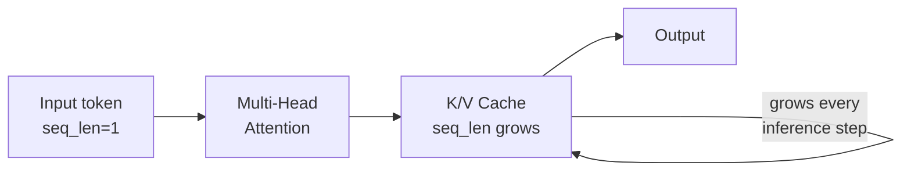
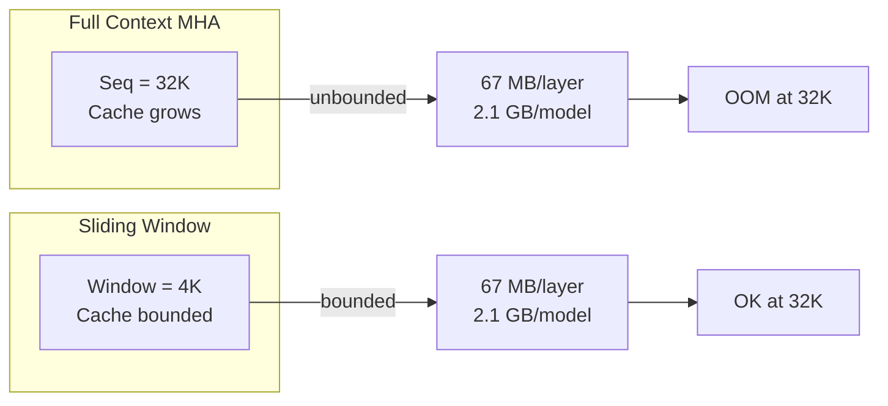

# KV Cache Formulas

The math core is the soul of hwLedger. This document walks through the derivation of KV cache formulas per attention architecture, with interactive breakdowns and live calculation.

## Overview

KV cache size depends on the **attention mechanism** (`AttentionKind`):

- **Multi-Head Attention (MHA)**: Full K and V for all heads
- **Grouped-Query Attention (GQA)**: Shared K and V across head groups
- **Multi-Query Attention (MQA)**: Single shared K and V
- **Multi-Head Latent Attention (MLA)**: Projected latent space
- **Sliding Window Attention**: Fixed-size context window
- **State Space Models (SSM/Mamba)**: Constant state per layer
- **Hybrid Attention**: Mix of patterns per layer
- **Sink Tokens**: Fixed sink cache + sliding window

Incorrect calculation costs hours of debugging and wasted VRAM. hwLedger derives formulas per architecture directly from the config.json fields.

## KV Cache Formula Derivation

### 1. Multi-Head Attention (MHA)

**Structure**: Full keys and values for all `num_heads` heads.

```
K_cache = [batch_size, seq_length, num_heads, head_dim]
V_cache = [batch_size, seq_length, num_heads, head_dim]
```

**Bytes per token**:

$$
\text{KV cache per token} = 2 \times \text{batch_size} \times \text{num_heads} \times \text{head_dim} \times \text{dtype_bytes}
$$

**Example**: Llama-2-70B with batch_size=1, seq_length=4096, dtype=float16:

- `num_heads = 64`
- `head_dim = 4096 / 64 = 64`
- `KV per token = 2 × 1 × 64 × 64 × 2 bytes = 16,384 bytes`
- `Total for 4K ctx: 16,384 × 4,096 ≈ 67 MB per layer × 80 layers ≈ 5.3 GB`



### 2. Grouped-Query Attention (GQA)

**Structure**: Keys and values grouped across `num_key_value_heads` heads (< `num_attention_heads`).

```
K_cache = [batch_size, seq_length, num_key_value_heads, head_dim]
V_cache = [batch_size, seq_length, num_key_value_heads, head_dim]
```

**Bytes per token**:

$$
\text{KV cache per token} = 2 \times \text{batch_size} \times \text{num_key_value_heads} \times \text{head_dim} \times \text{dtype_bytes}
$$

**Compression ratio**: `num_attention_heads / num_key_value_heads`

**Example**: Llama-2-70B (GQA variant) with batch_size=1, dtype=float16:

- `num_attention_heads = 64`
- `num_key_value_heads = 8` (8× compression vs MHA)
- `head_dim = 64`
- `KV per token = 2 × 1 × 8 × 64 × 2 bytes = 2,048 bytes`
- `Total for 4K ctx: 2,048 × 4,096 ≈ 8.4 MB per layer × 80 layers ≈ 672 MB`

**GQA saves 7–8× vs MHA**.

### 3. Multi-Query Attention (MQA)

**Structure**: Single shared K and V across all heads.

```
K_cache = [batch_size, seq_length, 1, head_dim]
V_cache = [batch_size, seq_length, 1, head_dim]
```

**Bytes per token**:

$$
\text{KV cache per token} = 2 \times \text{batch_size} \times \text{head_dim} \times \text{dtype_bytes}
$$

**Compression ratio**: `num_attention_heads` (maximum compression)

**Example**: With batch_size=1, dtype=float16:

- `head_dim = 64`
- `KV per token = 2 × 1 × 64 × 2 bytes = 256 bytes`
- `Total for 4K ctx: 256 × 4,096 ≈ 1.0 MB per layer × 80 layers ≈ 80 MB`

**MQA saves 64–80× vs MHA**.

### 4. Multi-Head Latent Attention (MLA)

**Structure** (Qwen2.5, Llama3.1): Keys and values projected to a low-dimensional latent space.

```
latent_dim = hidden_size / num_heads  (e.g., 4096 / 64 = 64)
```

**Bytes per token**:

$$
\text{KV cache per token} = 2 \times \text{batch_size} \times \text{latent_dim} \times \text{dtype_bytes}
$$

**Compression ratio**: `(num_heads × head_dim) / latent_dim ≈ num_heads`

**Example**: Qwen2.5-7B with MLA, batch_size=1, dtype=float16:

- `hidden_size = 4096`
- `num_heads = 16`
- `latent_dim = 4096 / 16 = 256`
- `KV per token = 2 × 1 × 256 × 2 bytes = 1,024 bytes`
- `Total for 4K ctx: 1,024 × 4,096 ≈ 4.1 MB per layer × 24 layers ≈ 98 MB`

**MLA saves ~7–8× vs MHA**, similar to GQA but more efficient for long sequences.

### 5. Sliding Window Attention (Mistral)

**Structure**: Only the last `window_size` tokens are cached.

```
K_cache = [batch_size, min(seq_length, window_size), num_heads, head_dim]
V_cache = [batch_size, min(seq_length, window_size), num_heads, head_dim]
```

**Bytes per token** (amortized):

$$
\text{KV cache per token} = 2 \times \text{batch_size} \times \min(\text{seq_length}, \text{window_size}) \times \text{head_dim} \times \text{dtype_bytes}
$$

**Example**: Mistral-7B with window_size=4096, batch_size=1, dtype=float16:

- Cache is **bounded** at 4K tokens regardless of context length
- `num_heads = 32`
- `head_dim = 128`
- `Max KV = 2 × 1 × 4,096 × 32 × 128 × 2 bytes ≈ 67 MB per layer × 32 layers ≈ 2.1 GB`
- `Savings vs 32K ctx MHA: 32K / 4K = 8×`



### 6. State Space Models (SSM / Mamba)

**Structure**: Constant state vector per token (no sequence dependency).

```
state = [batch_size, hidden_size]
```

**Bytes per state** (amortized):

$$
\text{State size} = \text{batch_size} \times \text{hidden_size} \times \text{dtype_bytes}
$$

**Example**: Mamba-7B, batch_size=1, dtype=float16:

- `hidden_size = 4,096`
- `State = 1 × 4,096 × 2 bytes = 8 KB per layer`
- `Total for 32 layers: 8 KB × 32 ≈ 256 KB`

**Savings vs MHA**: ~1000× (constant state, not linear in sequence length)

### 7. Hybrid Attention

**Structure**: Mix of MHA and sliding window across layers.

Some layers use full MHA; others use sliding window. Per-layer check:

```
if layer.attention_type == "sliding_window":
    cache_size = sliding_window_formula(...)
else:
    cache_size = mha_formula(...)
```

**Example**: Mixtral-8x7B (hybrid):

- Layers 0–20: MHA (full cache)
- Layers 21–31: Sliding window (bounded cache)
- `Total KV = (21 × mha_formula) + (12 × sliding_formula)`

### 8. Sink Tokens (Palm 2, LLaMA-long)

**Structure**: Fixed sink cache + sliding window for recent context.

```
sink_cache = [batch_size, num_sink_tokens, num_heads, head_dim]
sliding_cache = [batch_size, window_size, num_heads, head_dim]
```

**Bytes per token**:

$$
\text{KV cache} = 2 \times \text{batch_size} \times (\text{num_sink} + \text{window}) \times \text{head_dim} \times \text{dtype_bytes}
$$

**Example**: With `num_sink=4, window=4092, seq_len=32K`:

- Cache is bounded at 4,096 tokens (4 + 4092)
- Saves 8× vs full 32K MHA

## MoE-Aware Calculation

For Mixture-of-Experts models (Mixtral, Qwen-MoE):

- **Resident parameters**: Always loaded (shared layers, router)
- **Active parameters**: Only active experts loaded per forward pass

KV cache is computed on **all parameters**, not active-only, because it depends on sequence length, not expert sparsity.

```
total_kv = (num_layers × per_layer_kv)
```

## Interactive Breakdowns

Use the hwLedger planner to see live per-layer breakdowns:

```bash
cargo run --bin hwledger-cli -- plan \
  --model meta-llama/Llama-2-70b \
  --batch-size 1 \
  --seq-length 4096
```

Output (example):

```
Layer 0: MHA | KV: 67 MB | Params: 81.9 GB | Total: 81.9 GB
Layer 1: MHA | KV: 67 MB | Params: 81.9 GB | Total: 81.9 GB
...
Layer 79: MHA | KV: 67 MB | Params: 81.9 GB | Total: 81.9 GB
━━━━━━━━━━━━━━━━━━━━━━━━━━━━━━━━━━━━━━━━━━━━━
Total KV Cache: 5.3 GB | Weights: 6.5 TB | Unified Memory: 5.3 GB + 6.5 TB
```

## Comparison Table

| Architecture | Compression vs MHA | Example | KV at 4K ctx (1 batch) |
|---|---|---|---|
| **MHA** | 1× | Llama-2-70B | 67 MB/layer |
| **GQA** | 8× | Llama-2-70B-GQA | 8.4 MB/layer |
| **MQA** | 64× | Falcon-40B | 1.0 MB/layer |
| **MLA** | 7× | Qwen2.5-7B | 4.1 MB/layer |
| **Sliding window** | unbounded | Mistral-7B | 67 MB (capped at 4K) |
| **SSM/Mamba** | 1000× | Mamba-7B | 256 KB (total) |
| **Hybrid** | mixed | Mixtral-8x7B | varies |
| **Sink** | unbounded | Palm-2 | 67 MB (4K tokens) |

## Key Takeaways

1. **One size does not fit all**: Each architecture has different KV scaling characteristics.
2. **GQA is common**: Llama-2, Mistral, Qwen use GQA; saves 7–8× vs MHA.
3. **MLA is efficient**: New standard in Qwen2.5+ and Llama3.1; competes with GQA.
4. **Sliding window limits cache**: Mistral and Mixtral cap cache at 4K tokens.
5. **SSMs are cache-free**: Mamba and similar don't grow cache with sequence length.
6. **Per-layer check**: Always verify `config.json` for the exact mechanism per layer.

## References

- [Llama 2: Open Foundation and Fine-Tuned Chat Models](https://arxiv.org/abs/2307.09288)
- [Mistral 7B](https://arxiv.org/abs/2310.06825)
- [Mixtral of Experts](https://arxiv.org/abs/2401.04088)
- [Attention with Linear Biases Enables Input Length Extrapolation](https://arxiv.org/abs/2212.10554) (ALiBi, Sliding Window)
- [Mamba: Linear-Time Sequence Modeling with Selective State Spaces](https://arxiv.org/abs/2312.00752)
- [Efficient Streaming Language Models with Attention Sinks](https://arxiv.org/abs/2309.17453)
